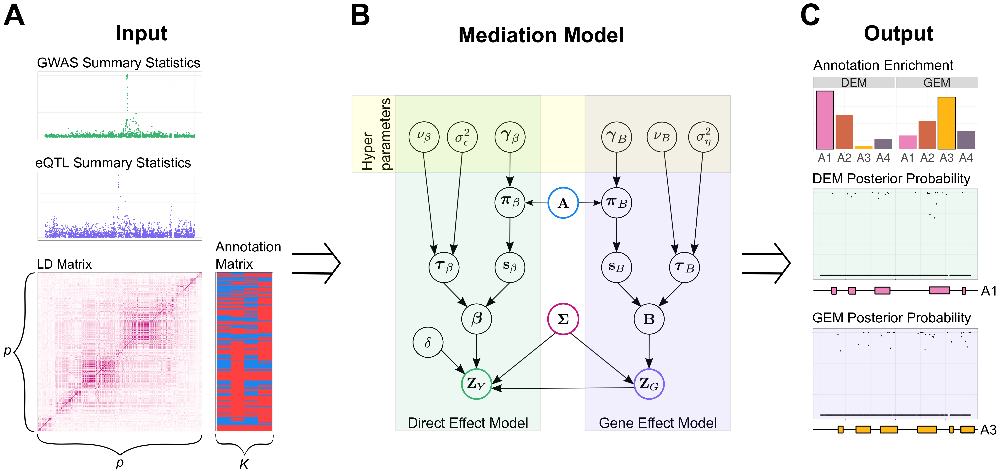
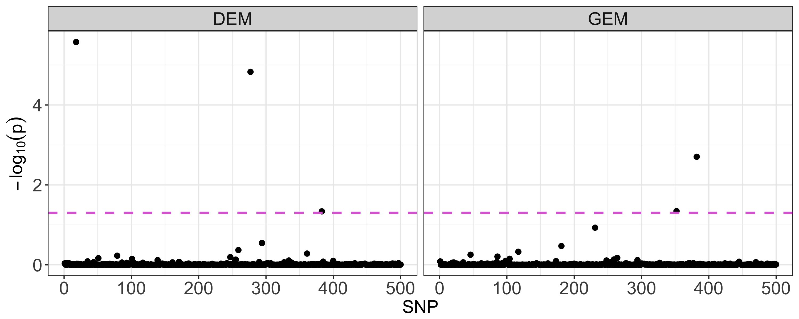

# iFunMed: Integrative Functional Mediation Analysis of GWAS and eQTL

Constanza Rojo, Qi Zhang, and Sündüz Keleş. "iFunMed: Integrative Functional Mediation Analysis of GWAS and eQTL." (under preparation).

Developed in the Keles Research Group in the University of Wisconsin - Madison. Contact Constanza Rojo (rojo@stat.wisc.edu) for questions and/or suggestions.


## Overview

*iFunMed* is a mediation model that utilizes functional annotation data as prior information and builds on summary statistics from GWAS and eQTL  studies. *iFunMed* model capitalizes on the functional annotation information when modeling the probability that a given SNP has a non-zero direct or indirect effect and, as a result, enables identification of SNPs that are associated with phenotypical changes through direct  phenotype-genotype  and/or indirect  phenotype-genotype through gene expression effect. Furthermore, we proposed a pipeline to enable selection of the functional annotations for direct and indirect effect models based on enrichment measurements. 




## iFunMed Model Fitting

We provide an example data file (`example_data.RData`) for new users to get familiar with *iFunMed*. It consists of a small set of 500 SNPs and contains the input for the model:
- GWAS.summstat: GWAS summary statistics
- eQTL.summstat: eQTL summary statistics
- LD.matrix: LD matrix (500x500)
- annotation.matrix: Functional annotation matrix with 5 different binary annotations (500x5)

`iFunMed_base.r` has the necessary elemets to run the model and consists of, mainly, four functions: 
- `vemMedSS`: Fits the direct effect part of the mediation model, adjusted by the mediator ().
- `vemDirectSS`: Fits the gene effect part of the mediation model ().
- `processFunMed`: Summarizes the `vemMedSS` and `vemDirectSS` outputs. 
- `annoEnrich`: Calculates enrichment values for the annotation matrix using the *iFunMed* fit without annotation.


Once you read `iFunMed_base.r` and load the `example_data.RData` data into your R session, you can fit *iFunMed*. You can run the model with annotation directly (Section 1), or following the annotation selection pipeline (Section 2). Details of the `processFunMed` output are in Section 3.

```
source('iFunMed_base.r')
load('example_data.RData')
```

### 1. Annotation Model

Let's say that out of the 5 annotations, we are only interested in the fifth annotation (`A5`). `anno.iFunMed` will be a 500x2 annotation matrix where the first column represents the intercept (all ones) and the second column is the `A5` binary annotation information. 
Then, we fit the model in a two step fashion with the functions `vemDirectSS` and `vemMedSS`.

```
anno.iFunMed <- cbind(1, annotation.matrix[, 'A5'])
vem.GEM.anno <- vemDirectSS(LD.matrix, GEMsummstats = eQTL.summstat, anno = anno.iFunMed)
vem.DEM.anno <- vemMedSS(LD.matrix, DEMsummstats = GWAS.summstat, GEMsummstats = eQTL.summstat, anno = anno.iFunMed)
```

`vem.GEM.anno` and `vem.DEM.anno` are objects that represent the direct and indirect effect information. We can use the `processFunMed` function to summarize the main outputs:
```
iFunMedAnno.output <- processFunMed(GEMoutput = vem.GEM.anno, DEMoutput = vem.DEM.anno)
```

### 2. Annotation Selection Pipeline

#### 2.1 Fit Model Without Annotation (Null Model)

Similarly to Section 1., we fit the model in a two step fashion with the functions `vemDirectSS` and `vemMedSS`. Since we are fitting the null model (without annotation), we set `anno = NULL` in both functions, which is also the default value.
```
vem.GEM.null <- vemDirectSS(LD.matrix, GEMsummstats = eQTL.summstat, anno = NULL)
vem.DEM.null <- vemMedSS(LD.matrix, DEMsummstats = GWAS.summstat, GEMsummstats = eQTL.summstat, anno = NULL)
```

We use `processFunMed` function to summarize the main outputs:
```
iFunMedNull.output <- processFunMed(GEMoutput = vem.GEM.null, DEMoutput = vem.DEM.null)
```

#### 2.2 Measure Annotation Enrichment 

Annotation enrichment values are calculated with the `annoEnrich` function. Based on the the direct and indirect effect posterior probabilities from the null model object (`iFunMedNull.output`) it calculates the average posterior probability of inclusion of the SNPs with the annotation (`avePP`:  and  in the manuscript) and obtains the measurement of enrichment for each annotation (`enrichment`:  and  in the manuscript).

The `parallel` library is required for utilizing `annoEnrich`.
```
library(parallel)
annoSelection <- annoEnrich(FunMedNull = iFunMedNull.output, annoMtx = annotation.matrix, Nperm = 10000, cores = 20)
> annoSelection
$avePP
$avePP$GEM
          A1           A2           A3           A4           A5 
1.023347e-06 9.965326e-03 1.350106e-02 1.023347e-06 9.227229e-03 

$avePP$DEM
          A1           A2           A3           A4           A5 
1.176456e-02 4.740930e-11 6.992922e-03 1.923054e-02 9.259147e-03 


$enrichment
$enrichment$GEM
    A1     A2     A3     A4     A5 
0.9971 0.2232 0.0770 0.9826 0.2499 

$enrichment$DEM
    A1     A2     A3     A4     A5 
0.3114 0.9972 0.4824 0.1963 0.3829 
```

Since the enrichment is calculated based on permutation, these values may vary slightly among different runs. 

#### 2.3 Fit Model With Enriched Annotations 

Based on the previous values, we can fit *iFunMed* with the most enriched annotation for each model and add the intercept to `A3` and `A4`. Alternatively, multiple annotations can be used.
```
annomtx.GEM <- cbind(1, annotation.matrix[, "A3"])
annomtx.DEM <- cbind(1, annotation.matrix[, "A4"])

vem.GEM.anno <- vemDirectSS(LD.matrix, GEMsummstats = eQTL.summstat, anno = annomtx.GEM )
vem.DEM.anno <- vemMedSS(LD.matrix, DEMsummstats = GWAS.summstat, GEMsummstats = eQTL.summstat, anno = annomtx.DEM)
```

Similarly, we use `processFunMed` to summarize results:
```
iFunMedAnno.output <- processFunMed(GEMoutput = vem.GEM.anno, DEMoutput = vem.DEM.anno)
```

### 3. `processFunMed` Outputs and Model Parameters

From the fitting with and without annotation, `processFunMed` will summarize the information from `vemDirectSS` and `vemMedSS`.
`iFunMedNull.output` and `iFunMedAnno.output` are lists with the following information:

- Convergency: Number of iterations and convergency status for direct and indirect effect models.
- Parameters: Direct and indirect effect estimated model parameters.
- PostProb: Posterior Probability of  inclusion (non-zero effect size) and FDR-corrected values for direct and indirect efect models.

For example, we can look at the `iFunMedAnno.output` object from Section 2.3: 
```
> str(iFunMedAnno.output)
List of 3
 $ Convergency:List of 2
  ..$ GEM:List of 2
  .. ..$ niter    : num 19
  .. ..$ converged: logi TRUE
  ..$ DEM:List of 2
  .. ..$ niter    : num 14
  .. ..$ converged: logi TRUE
 $ Parameters :List of 2
  ..$ GEM:List of 3
  .. ..$ gammaB: num [1:2] -5.466 0.791
  .. ..$ varEta: num 1.05
  .. ..$ nuB   : num 17.3
  ..$ DEM:List of 4
  .. ..$ gammaBeta : num [1:2] -5.97 1.93
  .. ..$ varEpsilon: num 0.886
  .. ..$ nuBeta    : num 26.9
  .. ..$ gamma     : num 0.0139
 $ PostProb   :List of 2
  ..$ GEM:List of 2
  .. ..$ PP    : Named num [1:500] 1.67e-06 7.56e-07 7.56e-07 1.67e-06 7.56e-07 ...
  .. .. ..- attr(*, "names")= chr [1:500] "SNP1" "SNP2" "SNP3" "SNP4" ...
  .. ..$ FDR.PP: Named num [1:500] 0.823 0.994 0.994 0.965 0.988 ...
  .. .. ..- attr(*, "names")= chr [1:500] "SNP1" "SNP2" "SNP3" "SNP4" ...
  ..$ DEM:List of 2
  .. ..$ PP    : Named num [1:500] 2.52e-08 3.68e-09 3.68e-09 2.52e-08 3.68e-09 ...
  .. .. ..- attr(*, "names")= chr [1:500] "SNP1" "SNP2" "SNP3" "SNP4" ...
  .. ..$ FDR.PP: Named num [1:500] 0.92 0.987 0.993 0.894 0.985 ...
  .. .. ..- attr(*, "names")= chr [1:500] "SNP1" "SNP2" "SNP3" "SNP4" ...
```

In this case, both models converged in less than 20 iterations. 

The parameters for the GEM are gammaB, varEta, nuB (, respectively) and gammaBeta, varEpsilon, nuBeta, gamma (, respectively) for the DEM.

Considering FDR control of 5% (purple dashed line), there are 3 SNPs that have a non-zero effect for the direct effect model and 2 SNPs for the gene effect model. 




### 4. Extra Information of `vemDirectSS` and `vemMedSS` 

#### 4.1 Other Function Arguments and Default Values
  
- Iterations: The maximum number of iterations the algorithm will do is set to a default of 200 (`iter.max`) and 100 for the M-Step (`iter.max.mstep`).
- Error: The algorithm stops when the hyperparameter estimation converges in relative error, such error is set to a default of 1e-5 (`er.max`).
- Parameter initialization: `init` is a list of initial parameters values. For the parameters associated to the annotation (gammaB and gammaBeta), the default is a vector of -1 as intercept and 0 for the annotations (`gammabeta = c(-1, rep(0, dim(anno)[2] - 1))`). The variances (varEpsilon and varEta) are initialized as the corresponding variance of the summary statistics (`sd(DEMsummstats)^2` and `sd(GEMsummstats)^2`). The signal variances (nuBeta and nuB) are set to 2 as their default initial values. 
```
init = list(gammabeta = c(-1, rep(0, dim(anno)[2] - 1)), vareps = sd(DEMsummstats)^2, nutau = 2)
```
- Posterior initialization: `posterior.init` is a list that contains `lodbeta`. It represents the inverse of the logit function and it's set to zero as default value, which translates as a 0.5 posterior probability for the SNP having signal. If you are using the `vemMedSS` function, `posterior.init` will also have an initial value of 0 for gamma. 
```
posterior.init = list(lodbeta = matrix(0, length(DEMsummstats), 1), mugamma = 0)
```

#### 4.2 Additional Output

Both functions contain output besides the information from `processFunMed`: 
```
> names(vem.DEM.anno)
[1] "posterior" "par"       "niter"     "converged" "hess"      "par.all"  
> names(vem.GEM.anno)
[1] "posterior" "par"       "niter"     "converged" "hess"      "par.all"  
```
- `posterior`: Variational E-Step information such as parameters mean and variances. Details can be found in Appendix A: Variational EM (Variational E-Step) of the manuscript.
- `par`: Model parameters, same as the one in `iFunMedAnno.output[['Parameters']]`.
- `niter` and `converged`: Convergency information, same as the one in `iFunMedAnno.output[['Convergency']]`.
- `hess`: Hessian at the solution found for the annotation parameter estimation (gammaBeta and gammaB).
- `par.all`: Parameter estimation in each iteration.


